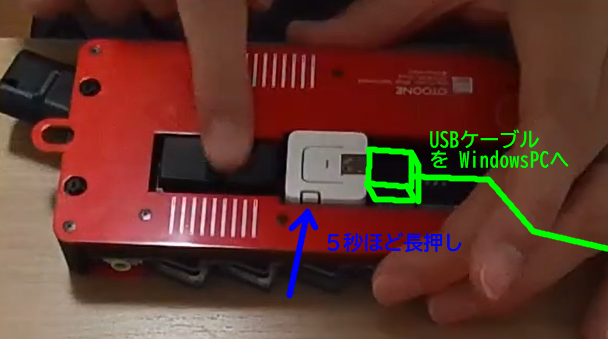
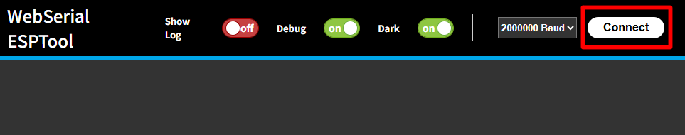
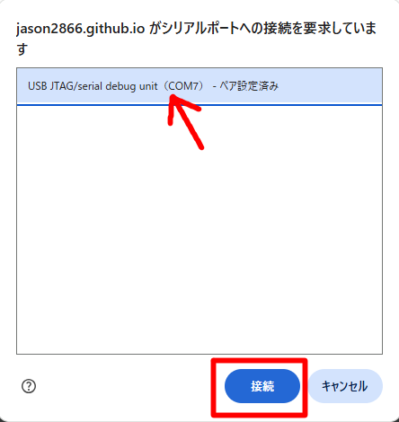
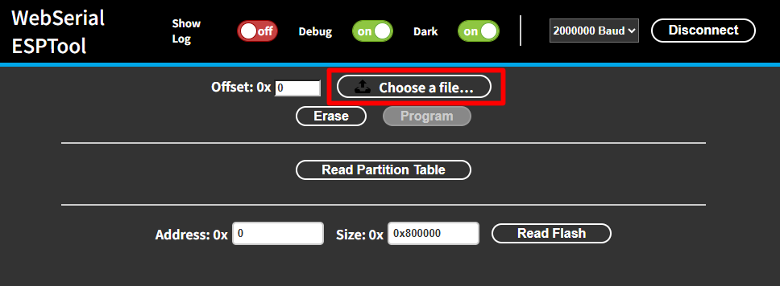
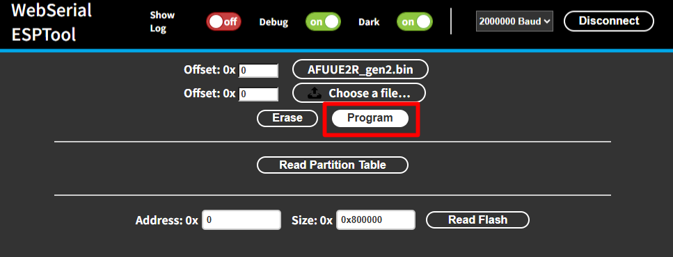

# AFUUE2R ソフトウェアアップデート、ソースコードについて

## ソフトウェアアップデート (bin ファイルの書き込み)

（ご注意）ソフトウェアアップデートを行った事で AFUUE2R が起動しなくなったり、AtomS3 (白い四角いマイコン) が故障したとしても、交換や金銭的な補償などはできかねます。

- [AFUUE2R_gen2.bin ダウンロード](AFUUE2R_gen2.bin)
- [AFUUE2R_gen2_lite.bin ダウンロード (lite=リップベンドなし版)](AFUUE2R_gen2_lite.bin)
1. 上記リンクから AFUUE2_gen2.bin (lite の場合は AFUUE2R_gen2_lite.bin) をダウンロードしてください。
2. AFUUE2R gen2 裏面の AtomS3 (白い四角いマイコン) を Windows PC に USB で接続し、横にある小さなボタンを5秒ほど長押しします。ボタンの根本に緑のランプが点灯することで書き込みモードに入ったことが確認できます。AtomS3 は AFUUE2R gen2 から外す必要はありません。

3. Windows PC の Chrome または Edge で下記ページを開きます。 
[WebSerial_ESPTool](https://jason2866.github.io/WebSerial_ESPTool/)
4. 右上の Connect を押します(ボタンが出てない場合はページの一番上にマウスカーソルを移動すると現れます)

5. USB_JTag / serial debug unit (COM5) などの文字の書かれたものを選択して接続を押します。

6. Choose a file ボタンを押し、ダウンロードした AFUUE2R_gen2.bin (lite は AFUUE2R_gen2_lite.bin) を選択します。 

7. Program ボタンを押します。
書き込みの緑のバーが最後まで進行したら終了です。Connect ボタンと同じ場所の Disconnect ボタンを押して接続を切って、USB ケーブルを抜いてください。 
もし AFUUE2R に電源を入れても起動しない場合は、再度書き込みをし、Disconnect してケーブルを抜いたら30秒ほど待ってから電源を入れてみてください。

## ソースコード (自分でプログラムしたい方向け)
- [AFUUE2R_gen2.zip ダウンロード](AFUUE2R_gen2.zip) 
zip ファイルを展開すると、中に README.md がありますので、ソースコードの取り扱いについてはそちらを参照ください。 
（質問いただければできる限りお答えしますが、基本的にはノーサポートと思ってください）

